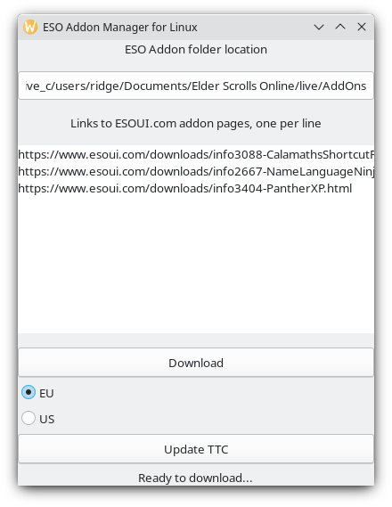

# ESOLinuxAddonManager

Very simple addon manager for Elder Scrolls Online running on Linux. Well, more a downloader for now.

Currently it's quite ugly but it gets the job done!

## How to use

* Download the app from releases
* Put it in any empty folder you wish
* Make sure the app has permissions to run (is set to executable)
* After opening the app, add
  * Your ESO addon location. For example, for me it is `/mnt/sda3/steam/steamapps/compatdata/306130/pfx/drive_c/users/steamuser/My Documents/Elder Scrolls Online/live/AddOns/`
  * Paste links to ESOUI.com addon pages, one per line. One link should look like, for example: `https://www.esoui.com/downloads/info602-Azurah-InterfaceEnhanced.html`
  * Press "Download"
  * If you have issues, the text below download button should tell you whats happening
* All your data is saved to text files
  * List of addons are in `addons.txt`
  * The ESO addon location is saved in `addonslocation.txt`
* If you use TamrielTradeCenter addon
  * Press "Update TTC" button to update the prices from the official pricelist

**Check issues for TODO and bugs!**

## How to build

* Make sure you have PyGObject installed: [https://pygobject.readthedocs.io/en/latest/](https://pygobject.readthedocs.io/en/latest/)
* To run the app from python, just type `python3 main.py`

For building a standalone app, use [Nuitka3](https://pypi.org/project/Nuitka/) and run following command in repository root:

`./build.sh`

Nuitka will warn you if you're missing dependencies.

It's worth noting that the onefile Nuitka generates is a bit slower to start, since it unpacks everything to a temp folder before launching.
Also I've noticed the filename cant have spaces, so use `.desktop` files to link to it.

## Contributing

Feel free to make issues if you encounter bugs, or comment on existing ones.
I am not looking for code contribution at the moment, but feel free to chat about things with me if you wish.

You can find me in my Discord: [https://discord.gg/PZkYZRx](https://discord.gg/PZkYZRx)

